# Before the pixels: measuring Tibetan font coverage for synthetic OCR

*Part 1 of a series on building a synthetic OCR benchmark for Tibetan — work supported by a [Khyentse Foundation](https://khyentsefoundation.org/) grant to improve Tibetan OCR at BDRC / OpenPecha.*

When you train an OCR model on synthetic pages, every wrong glyph becomes a wrong label. A font that “has Tibetan” in its `cmap` can still mangle a Sanskrit-style stack, swallow a *naro*, or drop a dotted circle next to a mark that never attached. For Tibetan — especially for the deep conjuncts that show up in mantras, *dhāraṇī*, and scholarly editions — **font coverage is not a checkbox; it is a matrix**.

Nothing quite like that matrix seemed to exist already: character-inventory tools and interactive font inspectors help designers, but they do not batch-test tens of thousands of corpus stacks across a large Tibetan font catalog with placement checks. So we built one.

This first post is about the gate we put *before* any pecha JPEG is generated: `coverage_report`, an open pipeline that asks, for every font face and every stack attested in BoCorpus, *does this actually render?*

---

## Where this sits in the series

The full synthetic-benchmark pipeline looks roughly like this:

```text
BoCorpus text
    → unique stacks
    → coverage_report  (this post)
    → render plan (font × page chunk, only if every stack is supported)
    → LuaLaTeX / fontspec / HarfBuzz → pecha images + labels
```

Later posts will cover chunking, layout, linguistic augmentation (shorthands, typos), and the train/val/test split across uchen and ume. None of that matters if the font cannot draw the stack that the label claims is on the page.

We classify fonts with BDRC’s script taxonomy: each digital face in the benchmark catalog carries a **script id**, which joins to the script list’s **3 types** (Uchen / Ume / Transitional) and **8 categories** (Zabma, Parma, Druma, Tsugma, …). Numbers below use that pivot — not whether the filename happens to say “Uchen.”

---

## A 30-second tour of Tibetan digital rendering

You do not need OpenType internals to follow the rest, but three layers help explain *why* naive checks fail:

1. **Font tables** — the font file maps Unicode code points to glyphs (`cmap`) and carries substitution / positioning rules (`GSUB` / `GPOS`). Vowels and marks are often *not* precomposed; they are placed by positioning.
2. **Layout engine** — we use [HarfBuzz](https://harfbuzz.github.io/) (`script=tibt`, `language=bo`). It walks the OpenType rules and emits a sequence of positioned glyphs.
3. **Glyphs on the page** — what you see. Missing coverage shows up as `.notdef` “tofu”, a dotted circle (U+25CC) for a mark that could not attach, or — worse — glyphs that *look* present but sit in the wrong place.

> Static table inspection (how many Tibetan code points are mapped, whether `mark`/`mkmk` exist) is useful for explanation. It is **not** decisive. A font can advertise Tibetan layout and still float a *zhabs kyu* in the middle of a tall stack.

In practice we harvest stacks from [BoCorpus](https://huggingface.co/datasets/openpecha/BoCorpus), shape every `(font, stack)` with HarfBuzz, keep the raw evidence in Parquet, then apply Tibetan-specific geometry rules that we tune against visual audit sheets.

---

## What “good” and “bad” look like (mostly uchen)

Ordinary uchen text — རྒྱ, སྐྱེ, མཁྱེན — is rarely the problem. Almost every serious face clears our ordinary probes. The interesting failures hide in **non-standard / Sanskrit-style stacks**, which are ~95% of the unique stacks in BoCorpus even though they are rarer token-by-token.

### Passes (uchen)

Deep stacks that still resolve into readable layers — all faces below are catalog **Uchen** (Zabma printscripts: Sugdri Sugring, tall/short Uchen, *kyuyig*, etc.):

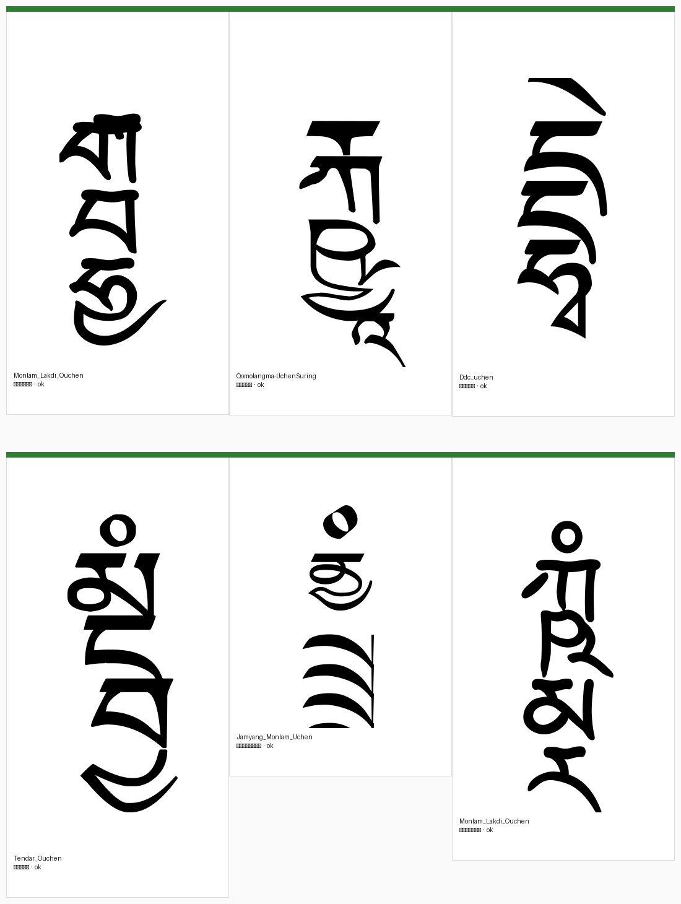

| Font | Catalog type | Stack | Why it matters |
|------|--------------|-------|----------------|
| Monlam Lakdi Ouchen | Uchen · Zabma | རྒྦྷྱཱ | Multi-layer *ba* / *ha* / *ya* under *ra-go*, with *āchung* |
| Qomolangma Uchen Suring | Uchen · Zabma | རྐྵྱཱ | *kṣa*-type conjuncts that many faces still get wrong |
| DDC Uchen | Uchen · Zabma | དྡྷྭེ | Ligated body + top vowel |
| Tendar Ouchen | Uchen · Zabma | མྔྦྱཾ | Deep stack + *anusvāra* |
| Jamyang Monlam Uchen | Uchen · Zabma | ནྱྲྲྲྲྲཾ | Stress test: repeated *ra* layers |
| Monlam Lakdi Ouchen | Uchen · Zabma | ཀྵྨྼྻུཾ | Very tall SKT stack still descending cleanly |

<p>
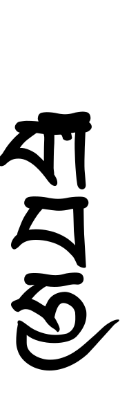
&nbsp;
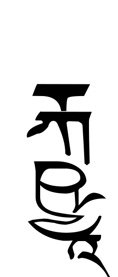
</p>

Ume faces that also clear the long SKT tail look different on the page, but the coverage question is the same. A few high-coverage ume passes on བྷྲཱུྃ:

<p>
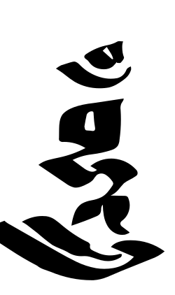
&nbsp;
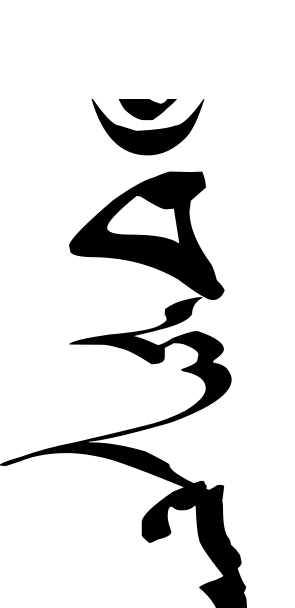
&nbsp;
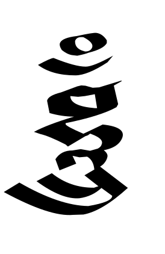
</p>

### Failures (uchen)

Same uchen fonts, stacks where shaping “succeeds” but the ink is wrong — or where the engine admits defeat with a dotted circle:

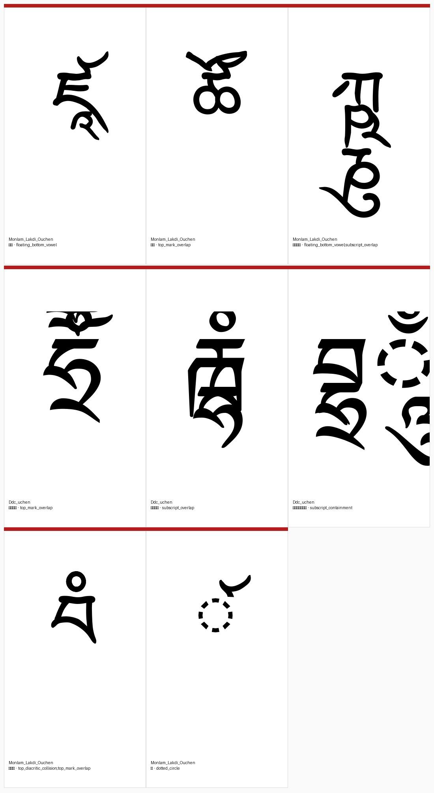

| Rule | Font | Stack | What you see |
|------|------|-------|--------------|
| `floating_bottom_vowel` | Monlam Lakdi Ouchen | ཛཱ | *āchung* does not sit under the body |
| `top_mark_overlap` | Monlam Lakdi Ouchen | ཚོ | *naro* collides with / is swallowed by the head |
| `subscript_overlap` | DDC Uchen | རྑྷཾ | Layers crush into each other |
| `subscript_containment` | DDC Uchen | བྷྲ྄ཱུྃ | A “subscript” drawn entirely inside the previous glyph |
| `top_diacritic_collision` | Monlam Lakdi Ouchen | བཾཾ | Repeated top marks pile on the same spot |
| `dotted_circle` | Monlam Lakdi Ouchen | ༹ | Mark never attaches; U+25CC appears |

<p>
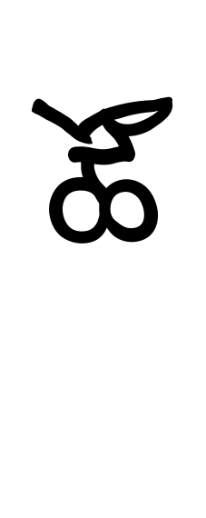
&nbsp;
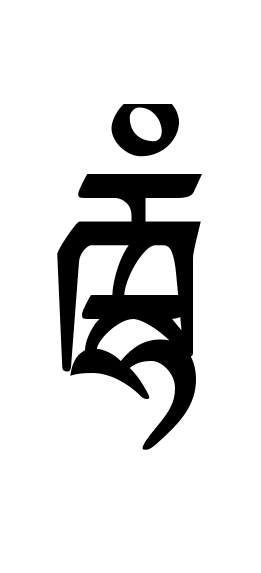
&nbsp;
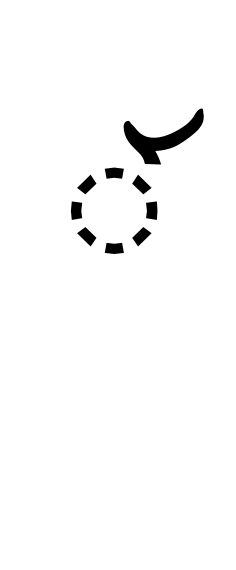
</p>

That last class is the honest failure. The dangerous ones are the middle rows: HarfBuzz returned glyphs, nothing was `.notdef`, and a naïve “shaped OK” check would have green-lit a page that no human would accept as uchen.

---

## The rules we implemented

Hard failures (shaping evidence):

- shape / font load error  
- `.notdef`  
- dotted circle  
- empty shape / zero ink  
- **`missing_base_letter`**: combining marks / subjoined letters with no Tibetan base consonant — common in shorthand lists that start a stack with *tsa-phru* (U+0F39); OpenType still treats that as a mark, so the engine inserts a dotted-circle base  
- for fonts flagged `skt_ok=0`: skip non-standard (non–hunspell-bo) stacks without shaping — those faces are only trusted for ordinary Tibetan  

Geometry / placement failures (bounding-box heuristics on the shaped glyphs):

| Rule | Intuition |
|------|-----------|
| `floating_bottom_vowel` | Bottom vowels (*āchung*, *zhabs kyu*, …) sit mid-stack instead of under it |
| `bottom_vowel_horizontal_misalignment` | *Zhabs kyu* (or another bottom vowel) drawn mostly beside the base — catches fonts that bake a dotted-circle fallback into the vowel glyph |
| `mid_stem` | Lowest body-attached layer (*zhabs kyu*, *ya-tag*, *ra-tag*, …) sits partway down the stem while the stem continues below it |
| `tsa_phru_mark_shift` | Reshape without U+0F39 and compare; fail when *tsa-phru* shoves other marks sideways |
| `tsa_phru_too_low` | U+0F39 center sits mid-stem instead of near the top-right of the letter |
| `mark_horizontal_misalignment` | U+0F35 / U+0F37 drift beside the base instead of under/over it |
| `top_mark_overlap` | Trailing top mark collides with or is swallowed by the body |
| `top_mark_horizontal_misalignment` | Top mark cluster mostly detached left/right |
| `top_diacritic_collision` | Repeated top marks share identical geometry |
| `subscript_horizontal_misalignment` | Next layer beside, not under, the previous one |
| `subscript_containment` | “Subscript” drawn entirely inside the previous component |
| `subscript_overlap` | Adjacent layers overlap too much to read as separate |
| `subscript_insufficient_descent` | Next layer does not start lower |
| `subscript_layer_collision` | ≥4 subscripts jammed into the same vertical band |

The newer rules (`mid_stem`, `tsa_phru_*`, `bottom_vowel_horizontal_misalignment`, `missing_base_letter`) came out of shorthand-pass visual review: fonts that look fine on ordinary BoCorpus stacks still break once *tsa-phru* and packed vowel clusters from abbreviation lists show up.

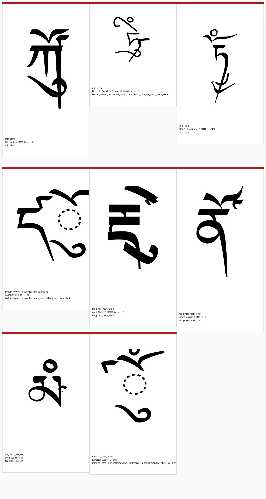

| Rule | Font | Stack (EWTS) | What fails |
|------|------|--------------|------------|
| `mid_stem` | DDC Uchen | `k^u+o` | *Zhabs kyu* hangs mid-stem on *ka* |
| `mid_stem` | Bhozuk Vijahara A | `t+yoM` | *Ya-tag* mid-stem (not only *tsa-phru* cases) |
| `tsa_phru_mark_shift` | Amdo Classic 2 | `rd^u+e` | *Tsa-phru* shoves *zhabs kyu* / *dengbu* |
| `tsa_phru_too_low` | Font | `m^aM` | *Tsa-phru* sits too low on *ma* |
| `bottom_vowel_horizontal_misalignment` | Kokonor | `d^u+o` | Bottom vowel beside the base (baked-in fallback) |
| `missing_base_letter` | Kokonor | `^u+oM` | Mark-only stack; no base letter |

<p>
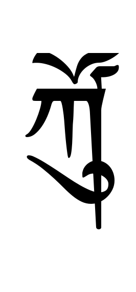
&nbsp;
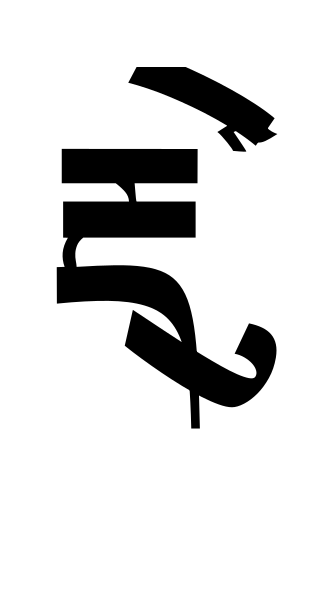
&nbsp;
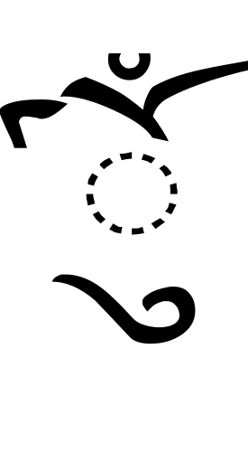
</p>

These are intentionally conservative. We keep raw Parquet rows, render audit contact sheets, and retune — a false positive in the coverage gate is a missing page; a false negative is a poisoned label. Known bad `(font, stack)` pairs from review also land in `synthetic_benchmark/data/shorthands/denylist.csv`.

Downstream, the render planner only accepts a `(font, page chunk)` if **every** stack in the chunk is supported with zero placement warnings.

---

## Results on BoCorpus × our font catalog

Probe set: **11,329** unique Tibetan stacks from BoCorpus (~453M stack occurrences in the corpus). Of those unique stacks, only **546 (~4.8%)** appear in syllables licensed by [hunspell-bo](https://github.com/eroux/hunspell-bo/); the rest are the long tail of Sanskrit-style and irregular forms that OCR still has to survive.

We shaped **218** digital faces (150 `skt_ok=1`, 68 `skt_ok=0`). **208** of them join cleanly to the benchmark catalog’s script id (the other 10 are uncategorized extras such as variable MiSans cuts).

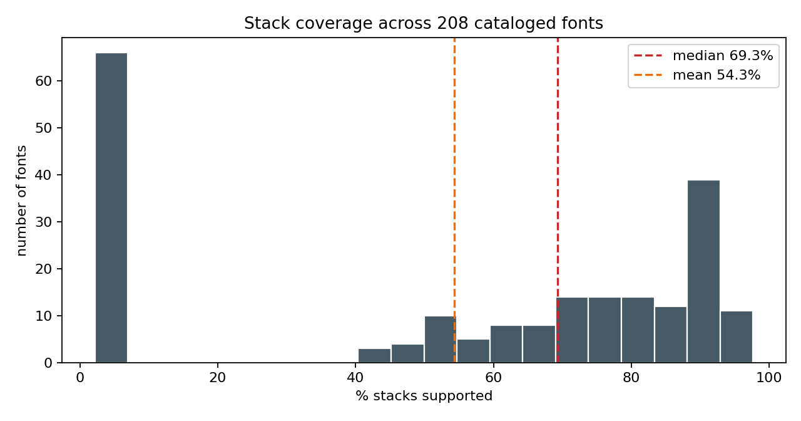

| Statistic (all 218 faces) | Value |
|---------------------------|------:|
| Max coverage | **97.7%** |
| Median | **66.8%** |
| Mean | **54.0%** |
| Min | **0.7%** |
| Fonts ≥ 90% | 35 |
| Fonts ≥ 80% | 75 |
| Fonts ≥ 50% | 142 |
| Fonts &lt; 10% | 69 |

Per stack, a typical conjunct is supported by about **54%** of fonts. **44** stacks work everywhere we tested; **39** work nowhere (pathological piles of marks on *shad* / *tsheg*, doubled top signs, etc.).

### Uchen vs ume (catalog taxonomy)

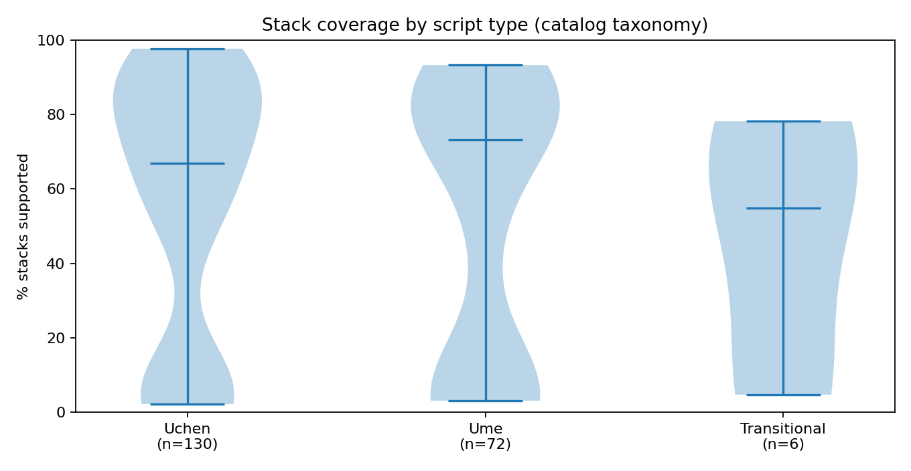

| Script type | Fonts | `skt_ok=1` | Median coverage | Mean | ≥90% | &lt;10% |
|-------------|------:|-----------:|----------------:|-----:|-----:|------:|
| **Uchen** | 130 | 93 | **67.0%** | 56.6% | 27 | 37 |
| **Ume** | 72 | 45 | **73.2%** | 50.9% | 8 | 27 |
| **Transitional** | 6 | 4 | 54.9% | 45.9% | 0 | 2 |

Restricting to faces already marked `skt_ok=1`, the medians converge (~**81.8%** uchen vs ~**81.4%** ume): the long left tail is mostly `skt_ok=0` faces that we only trust for the 546 standard stacks (~4.8% ceiling).

Within types, the 8-category medians are uneven. On the ume side, **Druma** (oval / *drutsa*) faces sit high (median ~86%), while many **Tsugma** cuts in the catalog are `skt_ok=0` and drag that category’s overall median down. On the uchen side, Zabma and Parma dominate the sample; the strongest individuals are Zabma printscripts and a few Parma / Nama faces.

### Who handles the stacks?

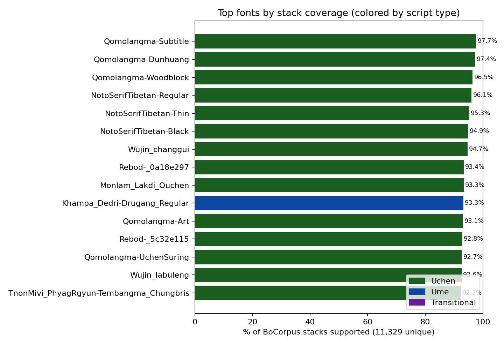

| Rank | Font | Type | Stacks OK | Coverage |
|-----:|------|------|----------:|---------:|
| 1 | Qomolangma-Subtitle | Uchen · Zabma | 11,063 / 11,329 | 97.7% |
| 2 | Qomolangma-Dunhuang | Uchen · Nama | 11,033 | 97.4% |
| 3 | Qomolangma-Woodblock | Uchen · Parma | 10,927 | 96.5% |
| 4 | Noto Serif Tibetan Regular | Uchen · Zabma | 10,884 | 96.1% |
| 5 | Noto Serif Tibetan Thin | Uchen · Zabma | 10,794 | 95.3% |
| 6 | Noto Serif Tibetan Black | Uchen · Zabma | 10,749 | 94.9% |
| 7 | Wujin changgui | Uchen · Zabma | 10,730 | 94.7% |
| 8 | Rebod | Uchen · Parma | 10,577 | 93.4% |
| 9 | Monlam Lakdi Ouchen | Uchen · Zabma | 10,571 | 93.3% |
| 10 | Khampa Dedri Drugang | **Ume · Tsugma** | 10,565 | 93.3% |

The overall top ten is almost all uchen — then an ume *tsugdri* face ties Monlam Lakdi. Filename heuristics would have mis-sorted several of these; the script-id join is what makes the uchen/ume split trustworthy for later render planning.

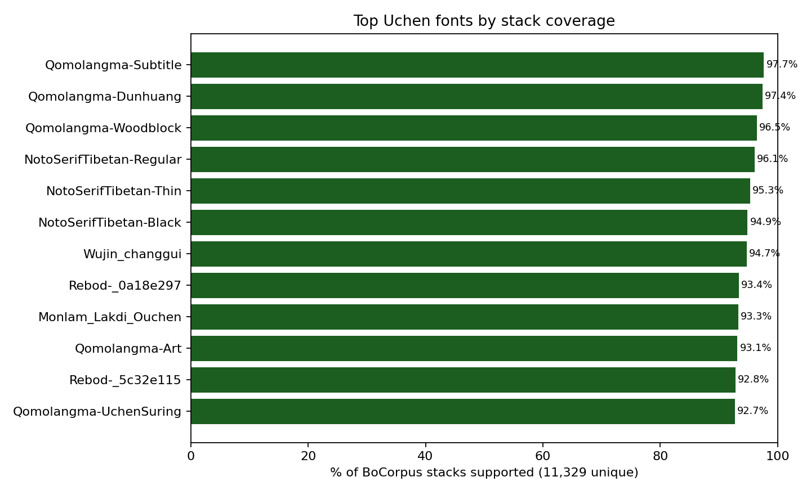

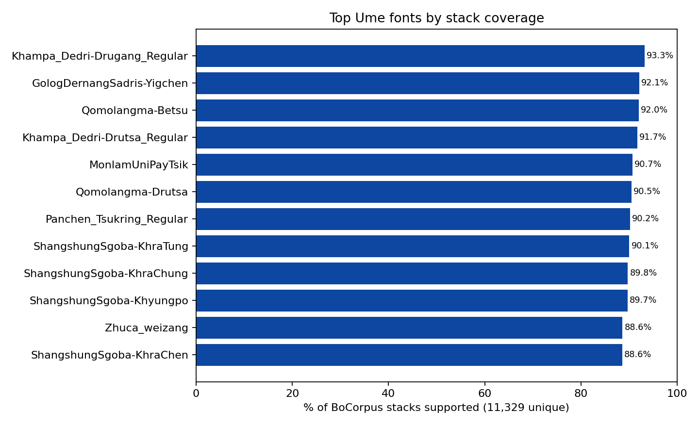

**Uchen highlights:** Qomolangma (Subtitle / Dunhuang / Woodblock / Art / Uchen Suring), Noto Serif Tibetan, Wujin, Rebod, Monlam Lakdi Ouchen (best Sugdri-style uchen on this run at 93.3%). Among everyday *kyuyig* / short-uchen faces, coverage drops quickly once you leave the SKT-capable band — DDC Uchen is only **65.2%** despite clearing ordinary probes, mostly on `floating_bottom_vowel` and `subscript_containment`.

**Ume highlights:** Khampa Dedri Drugang and Golog Dernang Yigchen (Tsugma, ~92–93%), Qomolangma Betsu / Petsug, Khampa Dedri Drutsa and Qomolangma Drutsa (Druma, ~90–92%), plus Shangshung and Zhuca *drutsa* cuts in the high 80s. The strongest ume faces match the strongest uchen faces on the BoCorpus stack list; weaker ume cuts fail for the same geometry reasons, not because “ume cannot do Sanskrit.”

The practical story for synthetic OCR: **almost every serious face looks fine on everyday Tibetan; uchen and ume diverge (and individual faces diverge) on the long SKT tail.** That is why a binary `skt_ok` flag was never enough for planning pages, and why we replaced it with a per-stack matrix joined back to the script taxonomy.

---

## Why this has to come first

Synthetic OCR usually starts from “pick a font, draw a page.” For Tibetan that recipe silently trains on:

- tofu and dotted circles labeled as real stacks  
- collapsed *kṣa* / *ddha* forms that no woodblock or modern press would produce  
- vowels that visually belong to the wrong consonant  

`coverage_report` flips the order: **measure support → plan only feasible (font, text) pairs → then generate images.** It is slower up front and much cheaper than discovering those bugs after a training run.

---

## Open source

The tooling lives in this repository under [`coverage_report/`](../coverage_report/), with the same workflow also published in the [OpenPecha tibetan-fonts](https://github.com/OpenPecha/tibetan-fonts) tree. Typical path:

```bash
python coverage_report/get_stacks_from_corpus.py
python coverage_report/build_support_dataset.py --mode both
python coverage_report/render_audit_sheet.py \
  coverage_report/out/stack_support.parquet \
  --kind placement-warning
```

Outputs: long-form Parquet evidence, a stack×font matrix CSV, per-font summaries, and audit contact sheets for human review.

Repo: [github.com/buda-base/synthetic-ocr-benchmark-tools](https://github.com/buda-base/synthetic-ocr-benchmark-tools)

---

*Next in the series: [turning the coverage matrix into pecha pages with LuaLaTeX](02-rendering-pecha-pages-with-lualatex.md).*

*This work is supported by the Khyentse Foundation as part of BDRC’s broader effort to improve Tibetan OCR and open Buddhist datasets for AI.*
