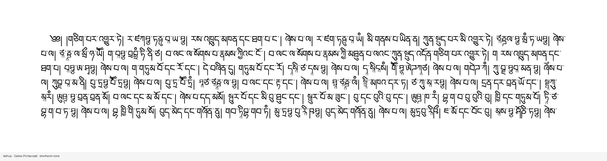
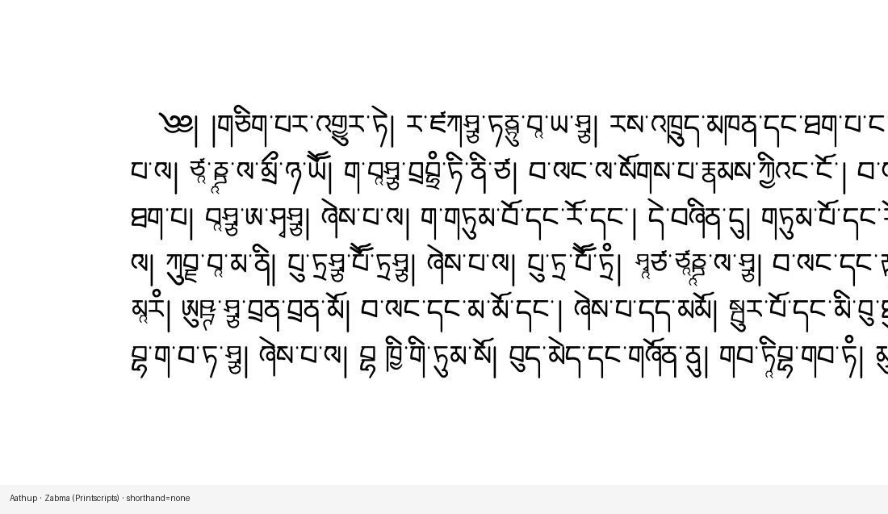
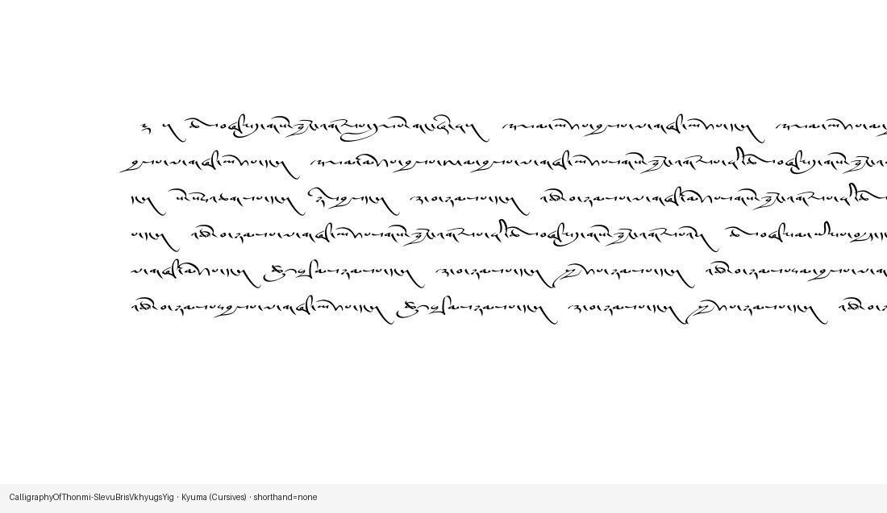

# From coverage matrix to pecha pages

*Part 2 of a series on building a synthetic OCR benchmark for Tibetan — work supported by a [Khyentse Foundation](https://khyentsefoundation.org/) grant to improve Tibetan OCR at BDRC / OpenPecha.*

[Part 1](01-font-coverage-before-synthetic-ocr.md) asked which fonts can draw which stacks. This post is the short next step: **turn accepted `(font, text)` pairs into pecha-shaped JPEG pages with line-accurate transcriptions**, using LuaLaTeX.



---

## Pipeline in one diagram

```text
BoCorpus chunks
    + stack_support.parquet   (from coverage_report)
    → build_render_plan.py    (reject unsupported stacks)
    → render_batches.py
         LuaLaTeX / fontspec / HarfBuzz
         → PDF pages
         → pdftoppm (mixed JPEG/TIFF, width 1800–3500 px)
         → alignment parquet (transcription with real line breaks)
```

The planner never asks a font to render a chunk that contains an unsupported stack. That is the whole point of part 1.

---

## Why LuaLaTeX?

We need the same OpenType Tibetan shaping that HarfBuzz used in the coverage gate, on real multi-line pages, with a known font file (including TTC face index). LuaLaTeX + `fontspec` gives us that, plus:

- pecha geometry (`paperwidth ≈ 4 × paperheight`, wide margins)
- per-syllable markers so we can rebuild the ground-truth text with the **same** line breaks the PDF produced
- batching many pages per font in one TeX run

Defaults look like a digital pecha strip: height 74 mm, width 296 mm, ~20 mm
side margins, and font size at `0.65 ×` the catalog’s normalized
`font_size_pt`. This keeps 90% of pages reasonably condensed; a deterministic
10% sparse subset receives a `1.20–1.35×` size multiplier. Variable leading and
extra clearance for tall stacks add independent density variation.
Every other exported page can get a `༄༅། །` prefix, matching common volume
openings.





---

## What a render plan row is

Each row is roughly: *one intended image* = one BoCorpus chunk + one font face + split label (train/val/test) + script taxonomy fields. The planner balances volume across the catalog’s `8 categories` (Zabma, Parma, Druma, Tsugma, …) while keeping uchen and ume volumes planned separately for later training mixes.

Source text is balanced independently for every font face, before shorthand or
other text augmentation:

- **50% normal:** compatible prose chunks containing no stacks above the corpus
  rarity threshold;
- **50% difficult:** compatible chunks prioritizing rare stacks and broader
  difficult-stack coverage.

Some fonts cannot render enough globally rare stacks to fill their difficult
half. In that case, the planner uses the most structurally complex compatible
common chunks for that font instead. The policy tier, actual rarity tier, and
fallback basis are recorded separately in
`source_text_difficulty_tier`, `source_text_rarity_tier`, and
`source_text_difficulty_basis`. Counts can differ by one when a font receives an
odd number of pages.

The planner also controls source repetition per font: 90% of slots prefer
low-repetition chunks, while 10% deliberately prefer repetitive chunks to keep
that phenomenon represented. Repetition is scored from dominant syllables,
adjacent duplicates, and repeated bigrams and trigrams, independently of the
normal/difficult rarity balance.

Concretely, each rarity pool has two deterministic orderings. Nine slots out of
ten draw from the lowest scores first; the tenth draws from the highest scores
first. The score is the maximum of the dominant-syllable fraction, adjacent
duplicate fraction, repeated-trigram fraction, and a down-weighted repeated-
bigram fraction. The requested policy and measured score are retained as
`source_text_repetition_policy` (`penalized` or `rewarded`) and
`source_text_repetition_score`, so downstream audits can distinguish deliberate
repetition coverage from accidental repetition.

At render time, chunks that overflow a physical page contribute only their **first** page to the benchmark; short underfull pages can be merged with the next chunk and re-rendered. Failures are logged per batch; successful batches checkpoint so long runs are resumable.

---

## Output shape

```text
images/.../0001.jpg          grayscale pecha JPEG
alignments/.../*_ptt.parquet transcription + font + script_8 + source span
```

That is enough for OCR training and for BUDA-style alignment catalogs. Linguistic tricks (shorthands) are optional and off by default — that is [part 3](03-shorthand-augmentations.md).

---

## Open source

```bash
python synthetic_benchmark/build_bocorpus_chunks.py
python synthetic_benchmark/build_render_plan.py \
  --support-parquet coverage_report/out/stack_support.parquet \
  --target-images 500000
python synthetic_benchmark/render_batches.py \
  synthetic_benchmark/out/render_plan.parquet \
  --out-dir synthetic_benchmark/out/dataset \
  --jobs 4
```

Code: [`synthetic_benchmark/`](../synthetic_benchmark/) in [buda-base/synthetic-ocr-benchmark-tools](https://github.com/buda-base/synthetic-ocr-benchmark-tools).

*Next: [injecting Tibetan shorthands without breaking font coverage](03-shorthand-augmentations.md).*
