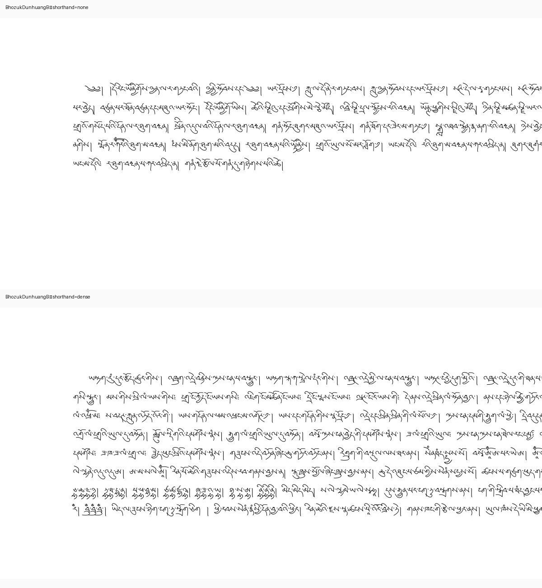
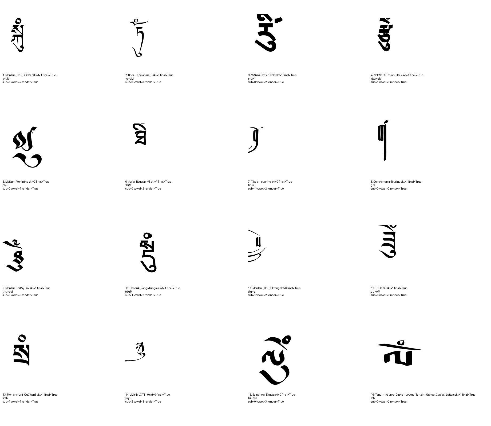
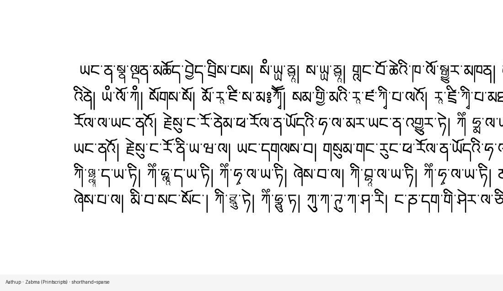
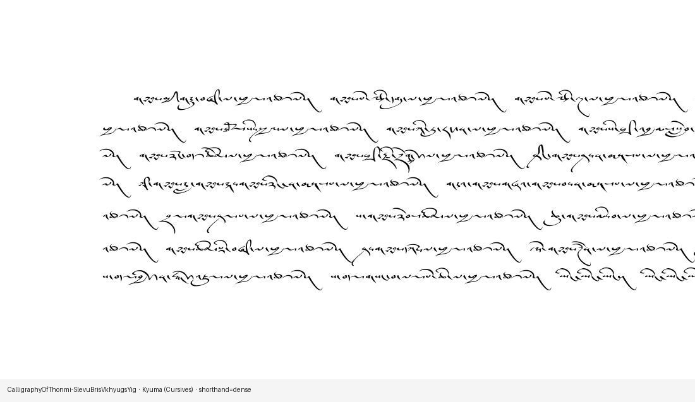

# Shorthand augmentations without breaking coverage

*Part 3 of a series on building a synthetic OCR benchmark for Tibetan — work supported by a [Khyentse Foundation](https://khyentsefoundation.org/) grant to improve Tibetan OCR at BDRC / OpenPecha.*

Real Tibetan pages — especially ume manuscripts and some printed handbooks — are full of **abbreviations**: contracted syllables, stacked vowels, *tsa-phru* tricks, and lexicon-specific shortcuts. If a synthetic benchmark only ever shows expanded dictionary forms, OCR will be brittle the first time it meets forms like `བསོདནཾས` for *bsod nams*.

This post is about how we add those forms **without** undoing the coverage work from [part 1](01-font-coverage-before-synthetic-ocr.md) or the LuaLaTeX rendering from [part 2](02-rendering-pecha-pages-with-lualatex.md).



---

## Lexicon first

We build a unified `long_form → shorthand` table from public sources (not MonlamAI / Pagan Tibet dictionaries in this pass):

| Source | Role |
|--------|------|
| [rKTs `abb.xml`](https://github.com/brunogml/rKTs) | Dzongkha handbook, Babelstone contractions, Bacot 1912 |
| [ERC-TibSchol abbreviations](https://github.com/ERC-TibSchol/abbreviations) | Corpus-attested scholarly abbreviations |

That yields on the order of **~3.7k** pairs in `shorthands.csv`. Each shorthand is tokenized into stacks; unique stacks (~**1.3k**) become coverage probes, tagged `probe_source=shorthand`, and are always shaped with HarfBuzz — even for `skt_ok=0` fonts.



---

## Review gate (same spirit as part 1)

Shorthand stacks are where several of the newer placement rules were born: *tsa-phru* too low or shoving other marks, *zhabs kyu* mid-stem, mark-only stacks with no base letter. Before any page injection is enabled we:

1. rebuild support with shorthand probes merged in  
2. render `shorthand-pass` audit sheets (labels show EWTS so merged vowels stay readable)  
3. either tighten heuristics or add rows to `denylist.csv` (`basename`, `shorthand`, `stack`, `reason`)

Only then may render pass `--enable-shorthands`.

---

## Injection policy at render time

Replacement is **font-aware**: a long form is contracted only if every stack in the shorthand is supported by that font and not denylisted. Ground truth is the **contracted** text (what is on the pixels).

Density follows script type (catalog taxonomy from part 1):

| Script type | Policy |
|-------------|--------|
| **Uchen** | Sparse: random replacements, capped around ~4 shorthands / 100 syllables (often fewer / none) |
| **Ume** | Dense on even plan rows; none on odd rows — so training sees both clean and abbreviation-heavy cursive pages |

Smoke plans can pin `shorthand_mode` per row (`none` / `sparse` / `dense`) and allocate exact with/without pairs per font for visual comparison.





---

## Why this ordering matters

```text
lexicon → shorthand stack probes → coverage + audit
       → denylist / new heuristics
       → optional injection at LuaLaTeX render
```

Skip the middle and you regenerate the false-positive problem from part 1, just on rarer stacks. Keep the gate and abbreviations become a controlled linguistic prior instead of a glyph lottery.

---

## Open source

```bash
python synthetic_benchmark/build_shorthand_lexicon.py
python coverage_report/export_shorthand_stacks.py
python coverage_report/build_support_dataset.py --mode both
python coverage_report/render_shorthand_audit.py \
  coverage_report/out/stack_support.parquet \
  --kind shorthand-pass

# after review:
python synthetic_benchmark/render_batches.py \
  synthetic_benchmark/out/render_plan.parquet \
  --enable-shorthands \
  --support-parquet coverage_report/out/stack_support.parquet
```

Code: [`synthetic_benchmark/shorthand_aug.py`](../synthetic_benchmark/shorthand_aug.py), [`data/shorthands/`](../synthetic_benchmark/data/shorthands/), and the coverage hooks in [`coverage_report/`](../coverage_report/).

*Next: [creating reviewed Tibetan font variants before rasterization](04-font-space-augmentation.md).*

*Series: [1 · Font coverage](01-font-coverage-before-synthetic-ocr.md) · [2 · LuaLaTeX pecha pages](02-rendering-pecha-pages-with-lualatex.md) · 3 · Shorthands · [4 · Font-space augmentation](04-font-space-augmentation.md)*
