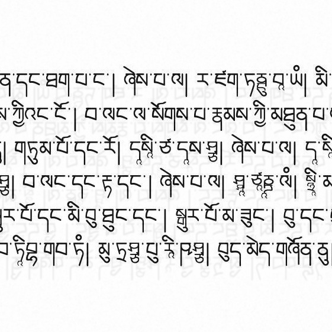
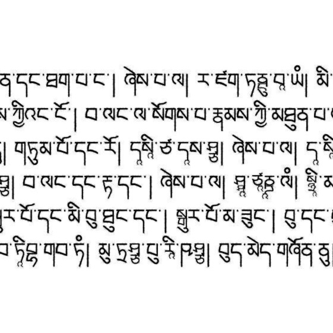
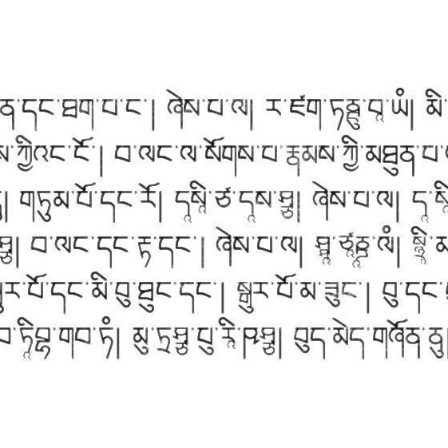
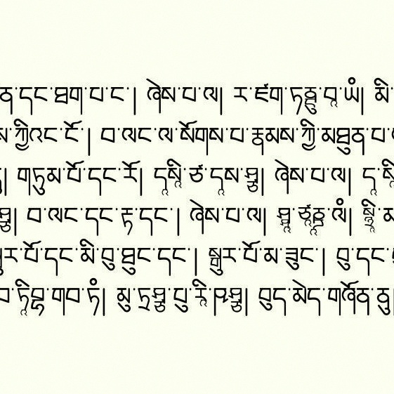
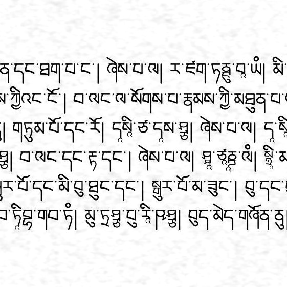
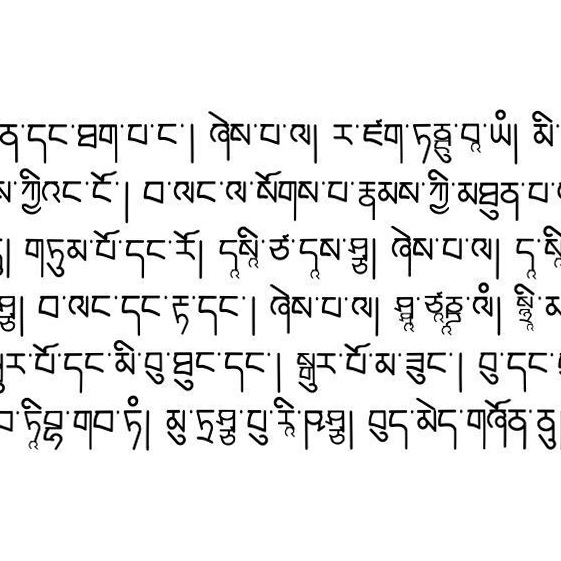
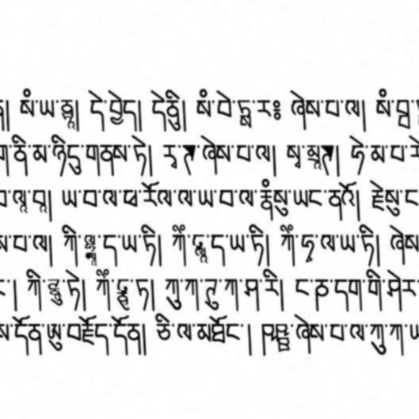
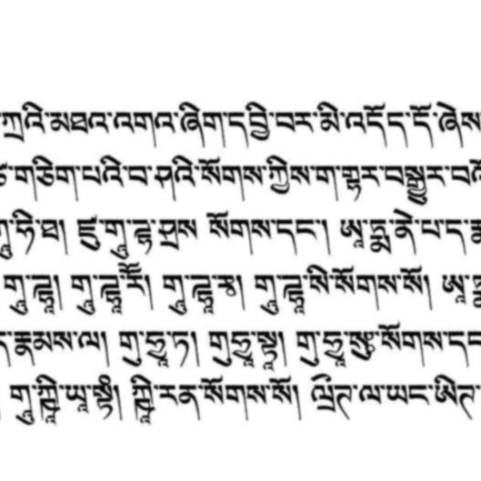
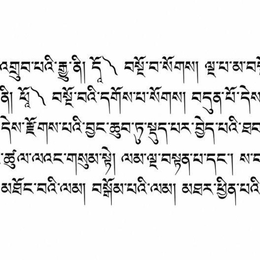

# After the glyphs: ink, paper, noise, folds, and blur

*Part 5 of a series on building a synthetic OCR benchmark for Tibetan — work supported by a [Khyentse Foundation](https://khyentsefoundation.org/) grant to improve Tibetan OCR at BDRC / OpenPecha.*

[Part 4](04-font-space-augmentation.md) changed vector outlines before rasterization. This post begins the next layer: **what happens to an otherwise clean rendered page when ink, paper, printing, and capture are imperfect?**

We are deliberately not attempting the full geometry of real scans yet. Page curvature, camera perspective, irregular baselines, and manuscript-specific deformation need measurements from real images. Here we stay mostly local: broken or spreading ink, paper texture, small displacement fields, an occasional fold, and modest blur.

---

## Review one effect at a time

We use [Augraphy](https://github.com/sparkfish/augraphy) as the main implementation reference. Before mixing anything, we rendered every candidate at mild, medium, and deliberately strong settings on both uchen and ume pages.

That review changed the policy:

- **keep:** bleed-through, ink bleed, letterpress, dirty-drum marks, dithering, noise texture, subtle noise, InkShifter, folding, and blur;
- **rare:** paper color, because most benchmark sources are effectively grayscale;
- **extremely rare and weak:** hollowing, which can erase too much of thin Tibetan very quickly;
- **remove:** low-light noise, whose strong behavior was not useful for the target documents;
- **remove:** `LinesDegradation`, because its name is misleading for this task.

`LinesDegradation` does not degrade lines of text. It searches for long, thin, straight gradient contours—table rules, underlines, form borders—and replaces portions with near-white pixels. Our pecha pages contain almost no such structures, so its samples correctly looked unchanged. Increasing it until it touched Tibetan letters would use the tool outside its intended target.

---

## Ink and printing

The following crops show effects on the same clean page:

- **bleed-through:** faint, offset ink from the reverse side;
- **ink bleed:** local spreading and thickening around strokes;
- **letterpress:** uneven ink transfer and faded regions;
- **dirty drum:** streaks and localized printer/scanner dirt;
- **dithering:** reduced tonal resolution, kept uncommon.

The center crop of the clean source:


Medium bleed-through:



Medium ink bleed:



Medium letterpress variation:



Mild dirty-drum marks:


The production pool favors mild and medium strengths. Strong dirty-drum and ink-bleed examples were useful as rejection boundaries, especially because thin ume strokes fail earlier than uchen.

Hollowing remains in the policy at only about **0.2% of all pages**, with a weaker range than the review samples. It is there to represent occasional incomplete ink bodies, not to turn every letter into an outline.

---

## Paper and small-scale noise

Subtle noise and multi-scale noise texture are the safest frequent effects. They break the perfectly flat digital background without changing the text geometry.

ColorPaper is assigned to roughly **2.7% of pages**. When document augmentation is enabled, all images are therefore saved as RGB JPEGs—even the uncolored ones—so this rare tint is not silently discarded by a final grayscale conversion. Runs without document augmentation keep the old grayscale output.

Medium paper color:



Medium multi-scale noise texture:



Medium subtle noise:


Noise texture deserves one implementation footnote: Augraphy repeatedly adds noise at decreasing spatial scales. Its `turbulence` value must remain at least 2; a value of 1 never reduces the scale and loops indefinitely. Our reviewed ranges avoid that corner.

---

## Small spatial effects and blur

InkShifter applies a low-amplitude displacement field to the ink. It gives locally wandering strokes without moving the entire page. Folding adds a narrow brightness/deformation band. Although folding is geometrical, we keep a mild version here because it is local and visually easy to audit; the broader geometry study comes later.

Medium InkShifter:



Medium folding:


Medium Gaussian blur:


Initial rates, balanced independently within every source font:

- **InkShifter:** 8% of pages, 75% mild and 25% medium;
- **folding:** 3%, one fold, mostly mild;
- **Gaussian blur:** 10%, mild or medium only—never strong.

Blur is applied after the other selected effects, matching an optical/capture stage rather than an ink-generation stage.

---

## Exactly 90% per font

A global 90% random probability can still leave a small font family badly unbalanced. Instead, we group the render plan by source font face and deterministically select the closest integer to **90% of that font's planned pages** for one local appearance effect.

Within those selected pages, the weighted pool currently favors:

1. subtle noise and noise texture;
2. ink bleed and letterpress;
3. bleed-through;
4. mild dirty-drum marks;
5. occasional dithering and paper color;
6. extremely rare hollowing.

InkShifter, folding, and blur are assigned independently, so a page may receive one local appearance effect plus one spatial effect and blur. The strongest levels are never used for those combinations.

The assignment is seeded by source font, face index, and image id. Every output catalog row records the selected effects, strengths, and seed, and the run writes a complete `document_augmentation_manifest.json`.

---

## The whole pipeline together

The samples below are not Photoshop mock-ups. These pages were produced by the real renderer with:

```text
BoCorpus text
    → optional font-aware shorthands
    → validated OpenType font variant
    → LuaLaTeX / HarfBuzz pecha page
    → local ink or paper effect
    → optional InkShifter or fold
    → optional mild/medium blur
    → RGB JPEG + transcription + provenance
```

The samples combine font-outline parameters, local image effects, spatial effects, blur, and—in some pages—coverage-checked shorthand substitutions.

Aathup with a generated font variant, noise texture, InkShifter, medium blur, and shorthand substitutions:



Amdo Classic 2 with a generated font variant, ink bleed, folding, and medium blur:



Amdo Classic 4 with a generated font variant, subtle noise, InkShifter, and mild blur:



This is the main reason for keeping the stages separate in code and metadata: if one combination hurts OCR, we can identify whether the problem came from the text, font outline, ink simulation, spatial shift, or blur.

---

## Open source

Render the one-effect review sheets:

```bash
python synthetic_benchmark/render_document_augmentation_audit.py
```

Enable the reviewed production policy:

```bash
python synthetic_benchmark/render_batches.py \
  synthetic_benchmark/out/render_plan.parquet \
  --out-dir synthetic_benchmark/out/dataset \
  --document-augmentation \
  --document-augmentation-rate 0.90 \
  --jobs 4
```

It can be combined with `--font-augmentation-variants 20` and `--enable-shorthands`. Code: [`document_augmentation.py`](../synthetic_benchmark/document_augmentation.py), [`render_document_augmentation_audit.py`](../synthetic_benchmark/render_document_augmentation_audit.py), and the integration in [`render_batches.py`](../synthetic_benchmark/render_batches.py).

*Next: [measuring real rotation and line curvature before synthesizing page geometry](06-measured-geometric-augmentation.md).*

*Series: [1 · Font coverage](01-font-coverage-before-synthetic-ocr.md) · [2 · LuaLaTeX pecha pages](02-rendering-pecha-pages-with-lualatex.md) · [3 · Shorthands](03-shorthand-augmentations.md) · [4 · Font-space augmentation](04-font-space-augmentation.md) · 5 · Image augmentation*
