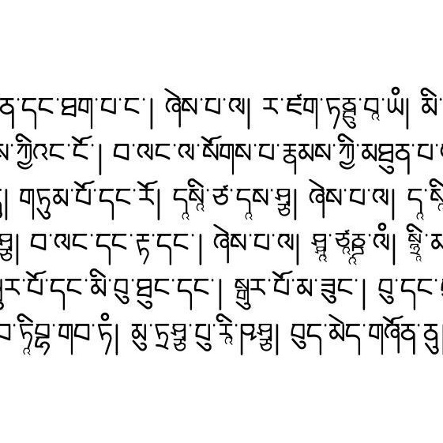
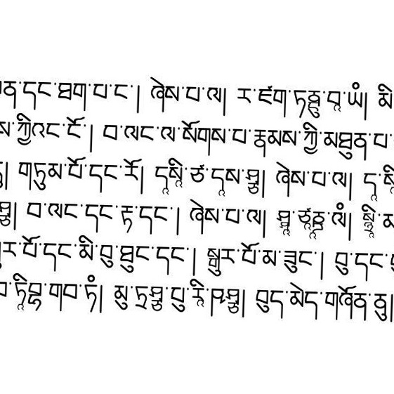
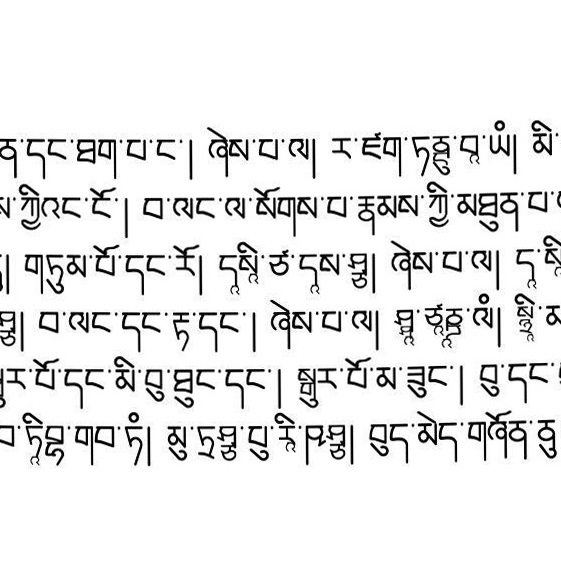
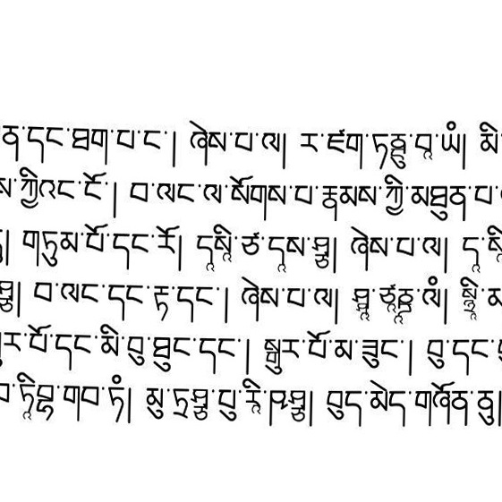

# Measuring real page geometry before synthesizing it

*Part 6 of a series on building a synthetic OCR benchmark for Tibetan — work supported by a [Khyentse Foundation](https://khyentsefoundation.org/) grant to improve Tibetan OCR at BDRC / OpenPecha.*

[Part 5](05-image-augmentation.md) introduced ink, paper, noise, folds, and blur. Rotation and curved text lines need a different approach: instead of choosing plausible-looking limits by hand, we measured what an existing Tibetan document pipeline actually detects.

---

## A quick note on line detection

The measurements come from **ldv1**, the line-detection pipeline used by version 1 of the BDRC application. It is the same model, not a newly trained detector for this benchmark.

The model predicts text-line regions. Its post-processing turns those regions into contours, estimates a global page rotation from their orientation, and—when a line remains curved after deskewing—records a thin-plate spline (TPS) correction. The TPS record contains five points sampled from left to right across the line.

ldv1 also appends the four image corners to every TPS record. Those corners are identity anchors: input and output coordinates are identical. They stabilize the interpolation but do not describe detected distortion, so we recognize and remove them before calculating statistics.

---

## Looking across many volumes

The orchestration database records **38,828 completed ldv1 volumes containing 19,475,403 pages**. Page-level geometry is stored separately in S3 as one Parquet result per volume.

Reading all 57 GB was unnecessary for parameter selection. We made a deterministic random sample of **512 volumes and 248,842 pages**, then stored the page summaries, normalized control points, histograms, quantiles, and sampling metadata in a local SQLite statistics database.

The main results were:

- **44.6%** of sampled pages had a nonzero rotation;
- the central 80% of detected rotations was approximately **−0.89° to +0.88°**;
- the central 95% was **−1.51° to +1.44°**;
- the 99th percentile of absolute rotation was **2.38°**;
- **3.02%** of pages had TPS correction points;
- every TPS record had exactly **five non-corner points** and vertical displacement only;
- median maximum TPS displacement was **2.17% of image height**;
- its 90th, 97.5th, and 99th percentiles were **3.04%**, **4.08%**, and **5.26%** respectively;
- all 7,516 sampled TPS records ended with the expected four identity corners.

These are model detections rather than manually verified physical measurements. They reflect both the documents and ldv1's thresholds. They are nevertheless much better boundaries than arbitrary elastic-warp settings.

Code: [`analyze_ldv1_distortions.py`](../synthetic_benchmark/analyze_ldv1_distortions.py). The generated database is `synthetic_benchmark/out/ldv1_distortion_stats.sqlite`.

---

## From observed frequency to benchmark policy

The production benchmark deliberately uses geometry more often than ldv1 observed it. This creates enough examples for an OCR evaluation to measure sensitivity without making the strongest cases normal:

- **70% of images are rotated:** 60% use the typical range up to about 0.9°, and 10% use the broader 0.9–2.4° range;
- **30% receive TPS distortion:** 20% use the typical range, with maximum displacement from about 1.2% to 3.04% of image height, and 10% use the stronger 3.04–5.26% range;
- TPS pages are selected from the rotated pages, retaining the relationship seen in ldv1;
- TPS uses five correlated, vertical-only control points at the measured horizontal positions;
- four fixed identity corners are added for stable interpolation, but are never sampled as distortions.

The percentages are balanced independently within every source font face. Parameters and strengths are deterministic from the run seed and are written into the image catalog and augmentation manifest.

Order matters. A clean page is first given TPS curvature and is then rotated. This reverses ldv1's correction sequence: the detector first removes global rotation and then straightens residual line curvature. Blur, when selected, remains the final capture-stage operation.

---

## What the ranges look like

The clean center crop, for reference:



A weak rotation of 0.55°:


A stronger rotation of −1.8°, still within the measured broad range:



Weak TPS curvature followed by a 0.4° rotation:



Strong TPS curvature followed by a −1.2° rotation:



The strong samples are intended to be visible, not bizarre. They stay inside the 99th-percentile boundaries measured from ldv1 rather than using the much larger defaults common in generic image-warp tools.

---

## Reproducible geometry

Enable the full reviewed document policy as before:

```bash
python synthetic_benchmark/render_batches.py \
  synthetic_benchmark/out/render_plan.parquet \
  --out-dir synthetic_benchmark/out/dataset \
  --document-augmentation \
  --jobs 4
```

The defaults are 70% rotation, 10% high rotation, 30% TPS, and 10% high TPS. They can be overridden with `--rotation-rate`, `--rotation-high-rate`, `--tps-rate`, and `--tps-high-rate`. The high rates are percentages of all images, not percentages of their augmented subsets.

Implementation: [`document_augmentation.py`](../synthetic_benchmark/document_augmentation.py), integration and metadata: [`render_batches.py`](../synthetic_benchmark/render_batches.py), and reproducible samples: [`render_blog_augmentation_assets.py`](../synthetic_benchmark/render_blog_augmentation_assets.py).

*Next: [reviewed real-paper backgrounds and mode-aware output encoding](07-real-paper-backgrounds-and-output-encoding.md).*

*Series: [1 · Font coverage](01-font-coverage-before-synthetic-ocr.md) · [2 · LuaLaTeX pecha pages](02-rendering-pecha-pages-with-lualatex.md) · [3 · Shorthands](03-shorthand-augmentations.md) · [4 · Font-space augmentation](04-font-space-augmentation.md) · [5 · Image augmentation](05-image-augmentation.md) · 6 · Measured geometry · [7 · Real paper and encoding](07-real-paper-backgrounds-and-output-encoding.md)*
