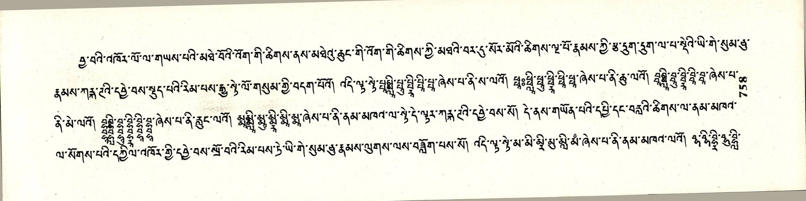
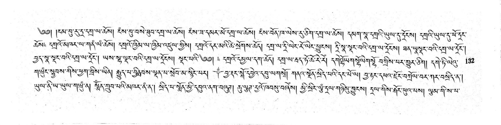
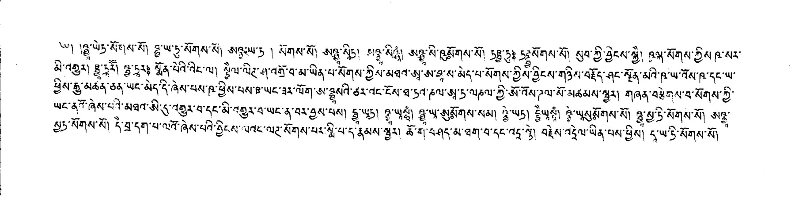
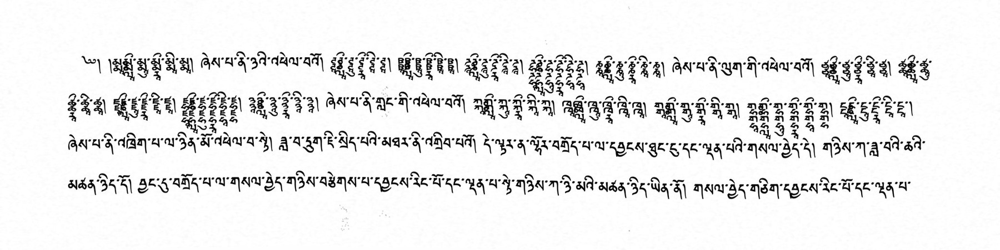
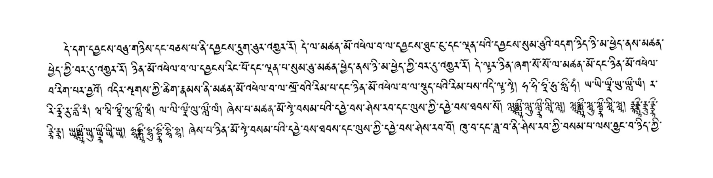
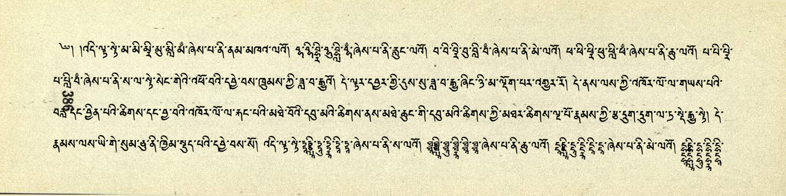

# Putting synthetic Tibetan text onto real paper

*Part 7 of a series on building a synthetic OCR benchmark for Tibetan — work supported by a [Khyentse Foundation](https://khyentsefoundation.org/) grant to improve Tibetan OCR at BDRC / OpenPecha.*

[Part 6](06-measured-geometric-augmentation.md) set rotation and line-curvature ranges from real document measurements. The remaining conspicuous difference was the page itself: even good synthetic ink still looked synthetic when it sat on a perfectly flat white rectangle.

This post adds manually reviewed paper backgrounds, makes paper selection an explicit part of the augmentation policy, and preserves the source image mode instead of converting every augmented page to RGB JPEG.

---

## A reviewed background collection

We began with 2,000 pages that the `script_classification_v2` pipeline had classified as blank. Candidates were restricted to pecha-like aspect ratios and downloaded at their original resolution for visual review.

Automatic blank-page classification is useful but not sufficient. Pages can still contain intrusive borders, catalog marks, severe damage, partial text, or other features that make them poor generic backgrounds. After two rounds of manual removal of unsuitable candidates, **1,087 backgrounds** remain:

- **840 RGB** pages;
- **111 grayscale** pages;
- **136 bilevel** (`1`) pages.

The retained list is committed as [`paper_backgrounds.csv`](../synthetic_benchmark/data/paper_backgrounds.csv). It records a stable background id, source S3 URI, dimensions, orientation, image mode, luminance statistics, and source identifiers. The images themselves remain in their original archive location; the renderer uses reviewed local copies when available and otherwise caches only the assigned sources from S3.

---

## One of three paper states

Paper appearance is now an exclusive deterministic choice, balanced independently for every source font face:

- **60% real background:** one reviewed blank page;
- **30% synthetic paper:** paper color, subtle noise, or multi-scale noise texture;
- **10% clean paper:** the original white render, without paper color or page noise.

“Clean” describes the paper state, not the entire page. Ink effects, rotation, TPS, folding, and blur are assigned separately, so a clean-white page can still have imperfect ink or measured geometric distortion.

Separating paper from ink fixes an ambiguity in the earlier policy. SubtleNoise, NoiseTexturize, and ColorPaper are no longer mixed into the same weighted pool as ink bleed and letterpress. Real-background pages never receive synthetic paper color or page noise. Ink effects can still be applied before any of the three paper states.

Brightness is not assigned blindly. The retained backgrounds now include mean,
percentile, contrast, and dark-pixel measurements and are divided into light,
medium, and dark tiers. Small text at low output resolution—and text receiving
lightening effects such as letterpress—is restricted to light paper. Once
LuaLaTeX reveals the actual line count, unexpectedly dense pages on dark or
medium paper switch deterministically to a light background of the same image
mode. This keeps the challenging dark scans for pages whose text remains large
enough to read.

---

## Start white, then composite the ink

Every page still begins as a conventional LuaLaTeX render: black Tibetan text on white. Local ink effects and InkShifter run on that white image first. For a real background, the grayscale rendered page then behaves like an ink transmission mask:

```text
output = paper × rendered_white_page / 255
```

White pixels reveal the paper, black pixels remain black, and antialiased edge pixels blend with the paper instead of producing a white halo. The reviewed background is stretched to the exact generated page dimensions when its aspect ratio differs; it is not cropped.

The complete image-stage order is:

```text
LuaLaTeX / HarfBuzz render on white
    → rasterize at 3500 px
    → resize to the page's assigned width
    → local ink effect and optional InkShifter
    → real, synthetic, or clean paper
    → optional fold
    → optional TPS curvature
    → optional rotation
    → optional blur
    → mode-aware encoding
```

TPS remains before rotation, preserving the correction-order reasoning from Part 6.

---

## The background determines the encoding

Keeping every augmented page as RGB JPEG would waste space and erase a useful property of the source material. Output now follows the selected paper:

- a grayscale background produces a grayscale JPEG;
- an RGB background produces an RGB JPEG;
- a bilevel background produces a bilevel TIFF with **CCITT Group 4** compression.

Synthetic color paper uses RGB JPEG. Synthetic grayscale noise and clean-white paper use grayscale JPEG. For bilevel output, the final composited page is thresholded back to one bit before Group 4 encoding; the TIFF therefore represents the same binary constraints as the selected source.

A real RGB paper page:



A real grayscale page:



A browser-friendly JPEG preview of a bilevel page—the raw benchmark image is a Group 4 TIFF:



For comparison, a synthetic-paper page:



And a clean paper state, still eligible for independent ink and geometry effects:



---

## Varying resolution and JPEG quality

Uniform image dimensions are another synthetic shortcut. Each page now receives a deterministic random width from **1,800 to 3,500 pixels**, inclusive, while retaining its pecha aspect ratio. Rasterization happens at the upper bound before the page is reduced to its assigned width, avoiding resolution loss from upscaling.

JPEG quality is **85** by default. A deterministic **10% of JPEG pages per font face** use quality **65**, adding a modest lower-quality encoding tail without making compression damage normal. Group 4 TIFF pages do not use a JPEG quality setting.

An example from the quality-65 subset:



The assigned width and JPEG quality are stored in every catalog and alignment row. A run-level `image_output_manifest.json` records the configured range, rates, seed, and per-font counts.

Ordinary line spacing varies independently from 1.18 to 1.32 times the font
size, centered on the previous 1.25 default. Pages containing five-, six-, or
seven-plus-codepoint Tibetan stacks receive progressively larger leading, while
LuaTeX supplies a final glyph-offset-aware safety check. Ordinary prose keeps
its normal density; only pages that need room for tall stacks become looser.

---

## Running the policy

The normal production command enables the complete document policy:

```bash
python synthetic_benchmark/render_batches.py \
  synthetic_benchmark/out/render_plan.parquet \
  --out-dir synthetic_benchmark/out/dataset \
  --document-augmentation \
  --jobs 4
```

The defaults are 60% real paper, 30% synthetic paper, 10% clean paper, widths from 1,800 to 3,500 pixels, JPEG quality 85, and a 10% quality-65 subset. Fixed-width experiments remain available through `--image-width-px`.

Implementation: [`paper_backgrounds.py`](../synthetic_benchmark/paper_backgrounds.py), [`update_paper_background_manifest.py`](../synthetic_benchmark/update_paper_background_manifest.py), [`document_augmentation.py`](../synthetic_benchmark/document_augmentation.py), [`image_output_policy.py`](../synthetic_benchmark/image_output_policy.py), [`page_layout_policy.py`](../synthetic_benchmark/page_layout_policy.py), and [`render_batches.py`](../synthetic_benchmark/render_batches.py).

*Series: [1 · Font coverage](01-font-coverage-before-synthetic-ocr.md) · [2 · LuaLaTeX pecha pages](02-rendering-pecha-pages-with-lualatex.md) · [3 · Shorthands](03-shorthand-augmentations.md) · [4 · Font-space augmentation](04-font-space-augmentation.md) · [5 · Image augmentation](05-image-augmentation.md) · [6 · Measured geometry](06-measured-geometric-augmentation.md) · 7 · Real paper and encoding*
